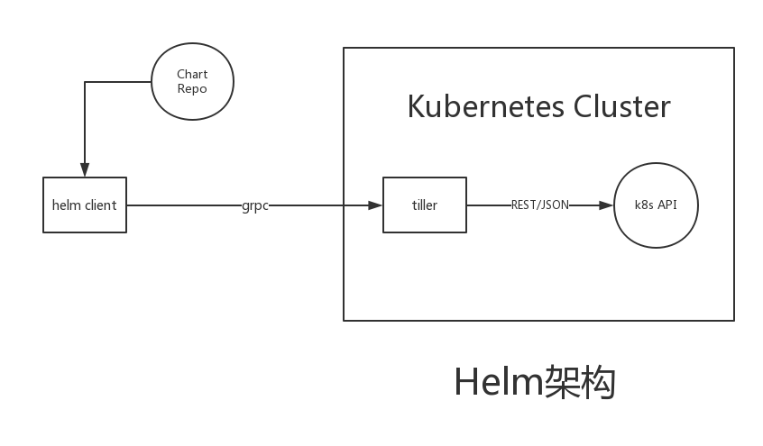

# helm添加REST API

## 环境

- go版本：go version go1.9.7 darwin/amd64
- glide版本：glide version 0.13.2-dev
- k8s版本: v1.10.0
- helm版本: v2.9.1
- protoc版本: 3.2.0

## helm介绍
### 简介

Helm是一个管理Kubernetes包的工具，称为charts。 Helm可以执行以下操作：

- 从头开始创建新charts
- 将charts打包成chart存档（tgz）文件
- 与存储chart的chart存储库交互
- 将charts安装和卸载到现有Kubernetes集群中
- 管理已使用Helm安装的charts的发布周期

对于Helm，有三个重要概念：
- chart:   charts是创建Kubernetes应用程序实例所必需的一组信息。
- config:  config是包含可以合并到打包chart中以创建可运行对象的配置信息。
- release: release是chart的运行实例，与特定config相结合。

### 组件

Helm有两个主要组成部分：

1. Helm Client是终端用户的命令行客户端。 客户端负责以下功能：

- 本地chart开发
- 管理chart仓库
- 与Tiller Server交互
    - 发送要安装的chart
    - 询问有关release的信息
    - 请求升级或卸载现有release

2. Tiller Server是一个集群内服务器，与Helm客户端交互, 并与
Kubernetes API服务器连接。 服务器端负责以下功能:

- 侦听来自Helm客户端的传入请求
- 结合chart和config来构建release
- 将chart安装到Kubernetes中，然后跟踪后续release
- 通过与Kubernetes交互来升级和卸载chart

总结，client负责管理charts，tiller server负责管理release。

### helm架构

由图看出，helm client与tiller server之间通过grpc通信, gRPC是由Google主导开发的RPC框架，
使用HTTP/2协议并用ProtoBuf作为序列化工具。

### 搭建helm开发环境

1. 下载安装protoc 3.2.0

   下载链接：[https://github.com/google/protobuf/releases](https://github.com/google/protobuf/releases)

2. 下载helm源码, 切换到v2.9.1分支

        go get -u k8s.io/helm
        cd $GOPATH/src/k8s.io/helm
        git checkout v2.9.1

3. 编译生成helm、tiller、protoc-gen-go二进制文件，自动下载vendor,protoc-gen-go移动至系统PATH下

        make bootstrap build

4. 安装grpc-go

        go get -u github.com/golang/protobuf/proto
        go get -u google.golang.org/grpc
        make protoc # 根据_proto目录下定义的protobuf文件，自动生成go代码，在pkg/proto/hapi目录下

## 思路

默认helm client和tiller server通信是grpc实现，并没有对外提供REST API. 现有两种思路仅供参考：

1. 自行构建REST API框架，通过grpc client直接与tiller server交互
2. 自行构建REST API框架，通过helm client直接与tiller server交互（推荐）

## 参考实现sample(列出release)

- [gohelm-client]()
- [gohelm-grpc]()

## 参考链接

- [https://docs.helm.sh/developers/](https://docs.helm.sh/developers/)
- [https://docs.helm.sh/architecture/](https://docs.helm.sh/architecture/)
- [https://github.com/grpc/grpc-go](https://github.com/grpc/grpc-go)
- [http://colobu.com/2017/03/16/Protobuf3-language-guide/](http://colobu.com/2017/03/16/Protobuf3-language-guide/)